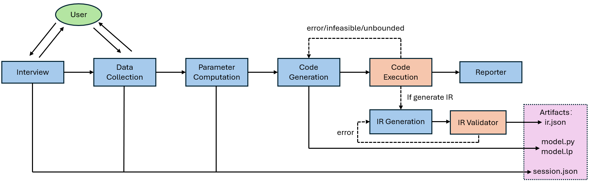
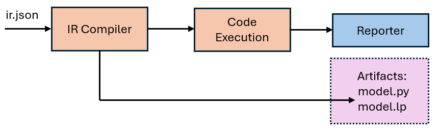
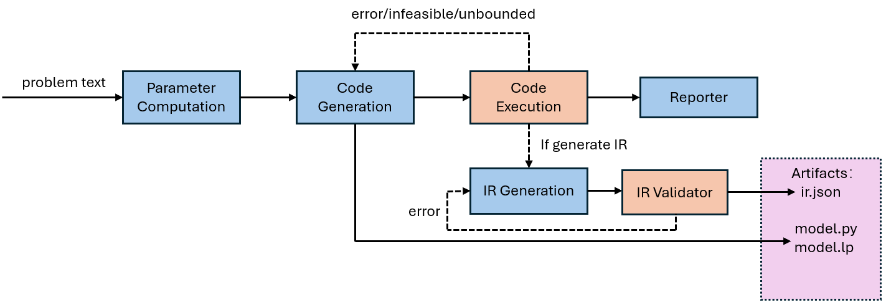

# ORPilot — AI Operations Research Modeling Agent

ORPilot is an open-source AI agent that turns natural-language business problems into working optimization models — automatically handling data ingestion, model formulation, and code generation across multiple solver backends with LLMs from multiple providers.

[](LICENSE)
[](https://www.python.org/)
[]()
[]()
[](PAPER_URL)

> 📄 [ORPilot: A Production-Oriented Agentic LLM-for-OR Tool for Optimization Modeling](https://arxiv.org/abs/2605.02728) — Guangrui Xie, 2026

The data used for testing in the experiments section (Section 4) of this paper can be found in the release assets of v0.1.0 release.

---

## Why ORPilot?

Most existing LLM-OR tools were created in a pure academic setting, where the problem description is clear and solver-ready data are already available — essentially solving a textbook OR problem. Building a working OR model from a real-world business problem is far more complicated. ORPilot is designed for that harder case.

**First, problem understanding is iterative.** Business users rarely articulate a complete, unambiguous problem specification in one go. ORPilot's interview agent asks targeted clarifying questions until the problem is fully understood before any modelling begins — just as a human consultant would.

**Second, data lives outside the prompt.** Real-world datasets are too large to embed in a language model context. ORPilot's data collection agent defines exactly what tabular data is needed (column names, types, semantics), guides the user to supply it as CSVs, and validates completeness before proceeding.

**Third, raw data is not the same as model parameters.** Given city coordinates, a routing model needs a distance matrix. Given transaction records, a scheduling model needs aggregated per-period costs. ORPilot's **parameter computation step** bridges this gap: it inspects the raw tables, identifies what derived quantities the model will need, generates and executes a Python script to compute them, and makes the results available as additional CSVs — so code generation always receives model-ready inputs.

**Fourth, reproducibility and portability matter for production.** ORPilot produces an **Intermediate Representation (IR)** — a compact JSON blob that captures all the information needed to reconstruct the OR model. Compiling from IR to solver code is fully deterministic. This means you can reproduce results, switch solver backends, or re-run the model on another machine without making any LLM calls.

**Finally, generated solver code is rarely perfect on the first attempt.** ORPilot wraps code generation in a **self-correcting retry loop** that feeds solver errors, infeasibility signals, and tracebacks back to the LLM for targeted repairs.

### Interactive pipeline

Blue indicates a LLM-involved step and orange indicates a deterministic step.
Sessions are automatically saved to `session.json` and can be resumed at any point — the agent picks up exactly where it left off.

### IR compiler pipeline

Blue indicates a LLM-involved step and orange indicates a deterministic step.

### Solve from text pipeline

Blue indicates a LLM-involved step and orange indicates a deterministic step.

### Key differentiators

| Feature | ORPilot | 
|---|:---:|
| Conversational problem intake | ✅ |
| Automatic data extraction to CSV | ✅ | 
| Parameter computation from raw data | ✅ | 
| Multi-solver backend (PuLP / Pyomo / OR-Tools / Gurobi / CPLEX) | ✅ | 
| Bring your own LLM (OpenAI / Anthropic / Google / DeepSeek / any OpenAI-compatible API) | ✅ |
| Structured IR for reproducibility and portability | ✅ | 
| Self-correcting retry loop with error feedback | ✅ | 
| Session save and resume | ✅ |

---

## Quick Start

**Step 1 — Install Python 3.10+**

*Windows:* Download and run the installer from [python.org](https://www.python.org/downloads/). Make sure Python is added to **PATH**.

*Linux (Debian/Ubuntu):*
```bash
sudo apt update && sudo apt install python3 python3-pip python3-venv
```

**Step 2 — Clone the repo and create a virtual environment**

```bash
git clone https://github.com/GuangruiXieVT/ORPilot
cd ORPilot
```

*Windows (Command Prompt):*
```cmd
python -m venv .venv
.venv\Scripts\activate
```

*Windows (PowerShell):*
```powershell
python -m venv .venv
.venv\Scripts\Activate.ps1
```
> If you see a "running scripts is disabled" error, run this once to allow local scripts for your user (no admin required), then retry.
> ```powershell
> Set-ExecutionPolicy -ExecutionPolicy RemoteSigned -Scope CurrentUser
> ```
> Alternatively, use **Command Prompt** instead of PowerShell — the CMD activation command works without any policy changes.

*Linux:*
```bash
python3 -m venv .venv
source .venv/bin/activate
```

**Step 3 — Install ORPilot and all solver dependencies**

```bash
pip install -e ".[all-solvers]"
```

Set your LLM API key:

```bash
export OPENAI_API_KEY=sk-...       # OpenAI
# export ANTHROPIC_API_KEY=...     # Anthropic
# export GOOGLE_API_KEY=...        # Google Gemini
# export OPENAI_API_KEY=sk-...     # DeepSeek — uses the OpenAI-compatible SDK, so set OPENAI_API_KEY to your DeepSeek key and configure base_url in orpilot.toml (see below)
```

It is recommended to manage your configurations in `orpilot.toml`. ORPilot picks up the configurations here automatically. CLI flags take precedence over values set here.

```toml
provider        = "openai"        # openai | anthropic | google
model           = "gpt-5-mini"    # any model your provider supports
solver          = "gurobi"        # gurobi | cplex | pulp | pyomo | ortools
time_limit      = 300             # solver time limit (seconds)
max_retries     = 3               # max code-generation retry attempts
show_solver_log = false           # stream solver output to stdout
verbose         = false           # show full error tracebacks on failure
temperature     = 1.0             # LLM sampling temperature (0.0 = deterministic)

data_dir        = "data"          # directory for input CSV files
output_dir      = "output"        # directory for generated code, LP file, solution

api_key         = "sk-..."        # or set OPENAI_API_KEY / ANTHROPIC_API_KEY / GOOGLE_API_KEY

# DeepSeek (or any OpenAI-compatible provider): set your key as OPENAI_API_KEY,
# then point base_url at the provider's endpoint.
# base_url = "https://api.deepseek.com"
# model    = "deepseek-reasoner"

generate_ir = false   # generate ir.json after each successful solve (for portability)
save_data   = false   # save data.json to output_dir, which contains the data extracted from the CSVs and is directly comsumed by generated solver code
```

CLI commands:

```bash
# ORPilot picks up the configurations from orpilot.toml automatically. CLI flags take precedence over values set there.

# Interactive session — ORPilot interviews you about your problem. Parameters auto-loaded from orpilot.toml file.
orpilot run

# Solve a problem described in a plain-text file (non-interactive)
orpilot solve path/to/your/problem.txt 

# Generate an IR from an existing completed output folder (requires model.py and session.json
# in the output folder, and CSVs at the path recorded in session.json's "data_dir" field)
orpilot generate-ir path/to/completed/output/

# Compile an IR into solver code only (no LLM, fully deterministic)
orpilot compile-ir output/ir.json 

# Compile and immediately run the optimization model, make sure the CSVs needed for this optimization model are in the directory specified by the "data_dir" field in orpilot.toml
orpilot compile-ir output/ir.json --run
```

---

## Installation

```bash
# Core + all solvers (Gurobi, CPLEX, PuLP, Pyomo, OR-Tools)
pip install -e ".[all-solvers]"

# Individual solver installation
pip install -e ".[<solver_name>]"  # for example, pip install -e ".[gurobi]"
```
Gurobi requires a license. Academic licenses are free at [gurobi.com/academia](https://www.gurobi.com/academia/academic-program-and-licenses/). Once obtained, activate it with:

```bash
grbgetkey YOUR-LICENSE-KEY
```
CPLEX requires a license. Academic licenses are available through the [IBM Academic Initiative](https://www.ibm.com/academic/topic/data-science). Once installed, CPLEX is picked up automatically via the `CPLEX_STUDIO_DIR` environment variable set by the installer — no additional activation step is needed.

Requirements: Python 3.10+

---

## Demo: Supply Chain Network Design

This demo problem is a much smaller-scaled version of the test problem in Section 4.2 of this paper: 

This walkthrough shows ORPilot solving a real-world **Mixed-Integer Program** end to end — from a plain-English conversation to an optimal production and distribution plan.

The user aims to optimize a supply chain network with multiple production sites, distribution centers, and customers. The user wants to decide which facilities to open and when, how much to produce at each site, and how to route products to customers — maximizing total profit over a planning horizon.

ORPilot's interview agent asks clarifying questions to fill in the details: cost structure, capacity types, demand patterns, inventory mechanics, and facility opening logic. Once the problem is fully specified, the data collection agent defines exactly which CSV tables are needed and validates them before solving.


**Interview - user conversation (excerpt):** 

Here is an excerpt of the conversation history between the interview agent and the user.

```
# For a full conversation trajectory between the interview agent and user, check demo/output/session.json

ORPilot  What is the primary goal you want to achieve with this optimization model?

User     I'm looking to maximize the profit of a supply chain network.

ORPilot  What are the main decisions you need the model to make to maximize profit?

User     I need to make production decisions for production sites, transportation
         decisions between production sites and distribution centers, transportation
         decisions between distribution centers and customers, and inventory decisions
         for production sites and distribution centers. I also need to make decisions
         about which production sites and distribution centers to open and when.

ORPilot  What are the main constraints or limitations in your supply chain network?

User     There are production capacities for production sites, throughput capacities
         for distribution centers. Inventory storage capacities for production sites
         and distribution centers. Customers' demands must be met. A production site
         must be open to produce products. A distribution center must be open to ship
         products to customers.

ORPilot  Once a production site or distribution center is opened in a period, does it
         remain open for all subsequent periods, or can it be closed in later periods?

User     Once a production site or distribution center is opened in a period, it
         remains open for all subsequent periods.

ORPilot  Perfect, I have everything needed. Proceeding to data collection.
```

**Data collection — user conversation (excerpt):**

Here is an excerpt of the conversation history between the data collection agent and the user.

```
# For a full conversation trajectory between the interview agent and user, check demo/output/session.json

ORPilot  Here is the specification of required CSV data files:

  sets.csv — all set members across every category
    Columns: set_name (str), element (str)
    Example:
      set_name,element
      production_sites,PS_001
      distribution_centers,DC_001
      customers,C_001
      products,P_100
      periods,1

  demand.csv — customer demand per product per period (sparse)
    Columns: customer_id, product_id, period_id, demand (float)

  transport_cost_prod_to_dc.csv — valid site→DC routes and unit costs (sparse)
    Columns: site_id, dc_id, unit_cost (float)

  ... (13 more files — production/throughput/storage capacities,
       production/transport/holding costs, revenue, fixed & operating costs)

  Please place all CSV files in the data directory and type 'ready'.

User     ready
```
Here is a full list of the CSV files the data collection agent specifies:

```
demo/data/
  sets.csv                      ← all set members (sites, DCs, customers, products, periods)
  demand.csv                    ← sparse: only (customer, product, period) combos with nonzero demand
  production_capacity.csv       ← capacity per site per period
  production_cost.csv           ← unit cost per site × product
  transport_cost_prod_to_dc.csv ← sparse: valid site→DC routes and unit costs
  transport_cost_dc_to_cust.csv ← sparse: valid DC→customer routes and unit costs
  throughput_capacity.csv       ← outbound capacity per DC per period
  storage_capacity_sites.csv    ← inventory limit per site
  storage_capacity_dcs.csv      ← inventory limit per DC
  holding_cost_sites.csv        ← holding cost per site × product
  holding_cost_dcs.csv          ← holding cost per DC × product
  fixed_cost_open_sites.csv     ← one-time cost to open each site
  fixed_cost_open_dcs.csv       ← one-time cost to open each DC
  operating_cost_sites.csv      ← per-period cost for an open site
  operating_cost_dcs.csv        ← per-period cost for an open DC
  revenue.csv                   ← unit revenue per product
```

**Model structure:**

A closer look at the model structure 

| Element | Description |
|---|---|
| **Sets** | 5 production sites · 5 distribution centers · 3 customers · 3 products · 3 periods |
| **Binary decisions** | Open/close each site and DC per period (monotonic: once open, stays open) |
| **Continuous decisions** | Production quantities · shipment flows (site→DC, DC→customer) · end-of-period inventory |
| **Objective** | Maximize profit = revenue − production − transport − holding − fixed opening − operating costs |
| **Constraints** | Production capacity · throughput capacity · storage capacity · demand fulfillment · inventory balance · big-M facility opening logic |

The transportation network is **sparse**: not every site can ship to every DC, and not every DC serves every customer. The valid routes are defined by the rows of the transport cost tables.

```
Production Sites          Distribution Centers        Customers
─────────────             ────────────────────        ─────────
PS_013 ──────────────────► DC_002 ──────────────────► C_0105
PS_013, PS_039, …  ──────► DC_006 ──────────────────► C_0006
PS_042, PS_044, …  ──────► DC_005 ──────────────────► C_0019
PS_047             ──────► DC_041, DC_044
                           (sparse links only)
```

**Solution report (excerpt):**

Here is an example solution report excerpt given by ORPilot for this demo problem. 

```
**Status:** Optimal | **Objective:** −$1,419,138 | **Solve time:** 0.07s

**Facility decisions**

Two production sites were opened across all three periods:
- **PS_042** and **PS_044** are active in every period.
- PS_013, PS_039, and PS_047 remain closed (fixed costs exceed contribution margin given the trimmed demand volume in this demo dataset).

Three distribution centres were opened:
- **DC_002**, **DC_005**, and **DC_044** serve all customers across all periods.
- DC_006 and DC_041 are closed.

**Shipment plan (key flows)**

| DC     | Customer | Product | Period 1 | Period 2 | Period 3 |
|--------|----------|---------|----------|----------|----------|
| DC_002 | C_0105   | P_317   | 38       | 34       | 43       |
| DC_005 | C_0019   | P_135   | 51       | 68       | 79       |
| DC_005 | C_0019   | P_277   | 32       | 27       | 27       |
| DC_005 | C_0019   | P_317   | 8        | 8        | 9        |
| DC_044 | C_0006   | P_135   | 10       | 12       | 11       |
| DC_044 | C_0006   | P_277   | 23       | 19       | 25       |

```

### Running the demo

Run the demo yourself following the steps below to replicate the results. 

```bash
# Copy demo data into the working data directory, run from root folder of ORPilot
cp -r demo/data/ data/

# Due to the non-determinstic nature of LLMs, the LLM-user conversation trajectory and required CSVs
# can be different if run from scratch. To ensure the same conversation trajectory and required CSVs,
# resume from the saved session.json in demo/output folder. Data will be read from ORPilot/data/ folder, and 
# results will be stored in ORPilot/output/ folder.
orpilot run --session demo/output/session.json --data-dir data/ --output-dir output/
```

> **Note:** `demo/output/session.json` contains a `data_dir` field indicating the path to the folder that stores the data. Before running, update that field to the absolute path of your local `data/` directory, e.g.:
> ```json
> "data_dir": "/absolute/path/to/your/ORPilot/data"
> ```

---

## Running the solve from text examples

There are 5 toy example problems in `examples` to test the solve from text pipeline. Each example problem has a text file describing the optimization problem to be solved with in-line data. The problem description and data are ingested into ORPilot for modeling and solving. 

```bash
# test the example with ir generation
orpilot solve examples/job_assignment/problem.txt --output-dir output/job_assignment --generate-ir
# test the correctness of the generated ir by compiling from ir to see if it produces the same result
orpilot compile-ir output/job_assignment/ir.json --data-dir output/job_assignment/data/ --out output/job_assignment/ir_test/model.py --run
```
---

## CLI Reference

### `orpilot run` — interactive session

```bash
orpilot run \
  --config orpilot.toml \            # TOML/JSON config file (auto-discovered if present)
  --provider anthropic \             # LLM provider: openai | anthropic | google
  --model claude-sonnet-4-6 \        # model name override
  --solver gurobi \                  # solver: pulp | pyomo | ortools | gurobi | cplex
  --problem problem.json \           # skip interview; load problem from JSON file
  --data data.json \                 # skip data collection; load data from JSON file
  --data-dir data/ \                 # CSV data directory
  --output-dir output/ \             # save model.py, ir.json, solution CSVs, metrics.json
  --max-retries 5 \                  # max code-gen retry attempts (default: 3)
  --time-limit 300 \                 # solver time limit in seconds (default: 300)
  --solver-log / --no-solver-log \   # stream solver log to stdout
  --verbose / --no-verbose \         # show full error details on failure
  --generate-ir / --no-generate-ir \ # generate ir.json after successful solve
  --api-key sk-... \                 # API key (or set OPENAI_API_KEY / ANTHROPIC_API_KEY)
  --base-url https://... \           # custom API base URL
  --temperature 1.0 \                # LLM sampling temperature
  --session session.json \           # explicit session file (default: output-dir/session.json)
  --no-resume \                      # always start fresh, ignore existing session file
  --save-data / --no-save-data       # save data.json to output-dir
```

### `orpilot solve` — solve from a plain-text problem file

```bash
orpilot solve problem.txt \
  --config orpilot.toml \
  --provider anthropic \
  --model claude-sonnet-4-6 \
  --solver gurobi \
  --output-dir output/ \
  --max-retries 3 \
  --time-limit 300 \
  --verbose / --no-verbose \
  --generate-ir / --no-generate-ir \
  --api-key sk-... \
  --base-url https://... \
  --temperature 0.0
```

### `orpilot generate-ir` — generate IR from an existing output folder

```bash
orpilot generate-ir output/ \
  --config orpilot.toml \
  --provider anthropic \
  --model claude-sonnet-4-6 \
  --api-key sk-... \
  --base-url https://... \
  --temperature 0.0
```

Reads `session.json` and `model.py` from the output folder and produces `ir.json` in the same directory. The CSV data files must still be present at the path recorded in `session.json`.

### `orpilot compile-ir` — compile ir.json → model.py (no LLM)

```bash
orpilot compile-ir output/ir.json \
  --out output/model.py \            # default: model.py next to ir.json
  --solver gurobi \
  --data-dir data/ \                 # directory storing the CSVs 
  --run \                            # solve + save CSVs + generate report after compiling
  --solver-log / --no-solver-log \
  --provider anthropic \             # for the reporter (only with --run)
  --model claude-sonnet-4-6 \
  --api-key sk-... \
  --base-url https://... \
  --temperature 0.0 \
  --config orpilot.toml
```

Pass a directory instead of a file path and `compile-ir` will look for `ir.json` inside it.

---

## Architecture

ORPilot is built on [LangGraph](https://github.com/langchain-ai/langgraph) with a typed state machine. Each agent node is independently testable and the pipeline is straightforward to extend.

```
orpilot/
  workflow/
    nodes/           ← interview, data_collection, param_computation,
    │                   direct_code_gen, ir_builder, solver_runner, reporter
    graph.py         ← LangGraph state machine + per-node observability
    state.py         ← WorkflowState TypedDict
  llm/
    openai.py        ← OpenAI + reasoning model support
    anthropic.py     ← Anthropic
    gemini.py        ← Google Gemini (google-genai SDK)
    base.py          ← BaseLLM interface with token usage tracking
    config.py        ← provider resolution and LLMConfig
  codegen/
    ir_compiler.py   ← IR → solver code (PuLP / Pyomo / OR-Tools / Gurobi / CPLEX)
    ir_validator.py  ← semantic validation before compilation
    executor.py      ← sandboxed code execution with full tracebacks
  models/
    ir.py            ← Pydantic IR schema
    problem.py       ← ProblemDefinition
    solution.py      ← SolutionResult
  prompts/
    *.md             ← versioned prompt files (YAML frontmatter with version tag)
    _loader.py       ← lru-cached prompt loader, exposes all_versions()
  solver/
    registry.py      ← solver lookup and registration
    pulp_solver.py   ← PuLP backend
    pyomo_solver.py  ← Pyomo backend
    ortools_solver.py← OR-Tools backend
    gurobi_solver.py ← Gurobi backend
    cplex_solver.py  ← CPLEX backend
```

### Intermediate Representation (IR)

The IR is a solver-agnostic JSON schema that captures sets, parameters, variables, the objective, and constraints. It enables:

- **Reproducibility** — re-run the model any time without calling the LLM again
- **Portability** — switch solver backends by recompiling from the same `ir.json`
- **Inspectability** — read and edit the model structure before solving

The IR compiler is fully deterministic: given the same `ir.json` and CSV data, it always produces identical solver code.

---

## Benchmark Results

**[IndustryOR](https://huggingface.co/datasets/CardinalOperations/IndustryOR)** — Industrial benchmark. 100 real-world industrial OR problems spanning supply chain, scheduling, routing, and resource allocation:

*Tested with Claude Sonnet 4.6*
| Difficulty | Passed | Total | Accuracy | 
|:---:|:---:|:---:|:---:|
| Easy | 31 | 39 | **79.5%** | 
| Medium | 24 | 41 | **58.5%** | 
| Hard | 20 | 20 | **100.0%** | 
| **Overall** | **75** | **100** | **75.0%** |

*Tested with DeepSeek-R1*
| Difficulty | Passed | Total | Accuracy | 
|:---:|:---:|:---:|:---:|
| Easy | 32 | 39 | **82.1%** | 
| Medium | 25 | 41 | **61.0%** | 
| Hard | 17 | 20 | **85.0%** | 
| **Overall** | **74** | **100** | **74.0%** |

*Tested with GPT-4o* 
| Difficulty | Passed | Total | Accuracy | 
|:---:|:---:|:---:|:---:|
| Easy | 23 | 39 | **59.0%** | 
| Medium | 14 | 41 | **34.1%** | 
| Hard | 9 | 20 | **45.0%** | 
| **Overall** | **46** | **100** | **46.0%** | ← Better than OptiMUS-0.3 (37%) reported in [arxiv:2407.19633](https://arxiv.org/abs/2407.19633) 

**[NL4OPT](https://huggingface.co/datasets/CardinalOperations/NL4OPT)** — Academic LP benchmark with 231 problems with known optimal solutions:

| LLM | Accuracy |
|:---:|:---:|
| Claude Sonnet 4.6 | **73.2%** |
| DeepSeek-R1 | **76.6%** |
| GPT-4o | **71.0%** | 

**[NLP4LP](https://huggingface.co/datasets/udell-lab/NLP4LP)** — Natural-language OR benchmark requiring end-to-end problem formulation and solving:

| LLM | Accuracy | 
|:---:|:---:|
| Claude Sonnet 4.6 | **79.8%** |
| DeepSeek-R1 | **76.7%** | 
| GPT-4o | **69.8%** | 

---

## Running Benchmarks

```bash

# IndustryOR benchmark
pytest tests/benchmark/test_industryOR.py -m industryOR -v

# Filter by difficulty or cap the number of cases
pytest tests/benchmark/test_industryOR.py -m industryOR --difficulty Easy --limit 10 -v

# NL4OPT benchmark
pytest tests/benchmark/test_NL4OPT.py -v

# NLP4LP benchmark (gated dataset — requires HF_TOKEN)
pytest tests/benchmark/test_NLP4LP.py -v
```

---

## Observability

After every successful solve, ORPilot writes `metrics.json` to the output directory with per-node token usage, latency, and retry counts:

```json
{
  "solver": "pulp",
  "nodes": {
    "interview":         { "input_tokens": 1820, "output_tokens": 312, "latency_s": 4.1, "retries": 2 },
    "data_collection":   { "input_tokens": 940,  "output_tokens": 180, "latency_s": 2.3, "retries": 0 },
    "param_computation": { "input_tokens": 1100, "output_tokens": 95,  "latency_s": 1.8, "retries": 0 },
    "direct_code_gen":   { "input_tokens": 3200, "output_tokens": 820, "latency_s": 6.7, "retries": 1 },
    "solver_runner":     { "input_tokens": 0,    "output_tokens": 0,   "latency_s": 0.4, "retries": 0 },
    "reporter":          { "input_tokens": 620,  "output_tokens": 210, "latency_s": 2.1, "retries": 0 }
  },
  "totals": { "input_tokens": 7680, "output_tokens": 1617, "latency_s": 17.4 },
  "solution_status": "optimal",
  "objective_value": 142500.0,
  "prompt_versions": { "interview_system.md": "1.0.0", "direct_code_gen_pulp.md": "1.0.0" }
}
```

---

## Contributing

Contributions are welcome — new benchmark cases, solver backends, LLM providers, or prompt improvements.

```bash
git clone https://github.com/GuangruiXieVT/ORPilot
cd ORPilot
python -m venv .venv
.venv\Scripts\activate  # Linux: source .venv/bin/activate  
pip install -e ".[dev]"
pytest
```

---

## License

MIT — see [LICENSE](LICENSE).

---

*ORPilot is actively developed. Benchmark numbers reflect accuracy results as of May 2026.*
